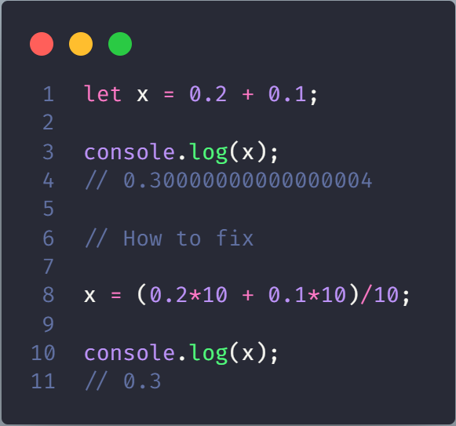
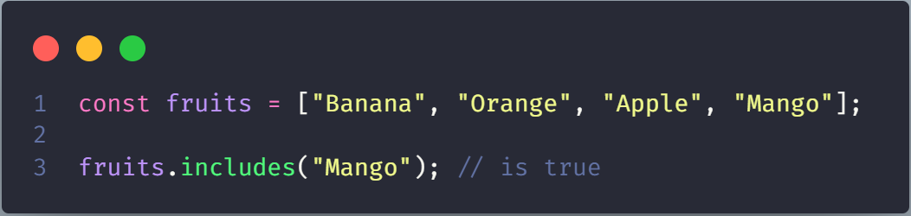
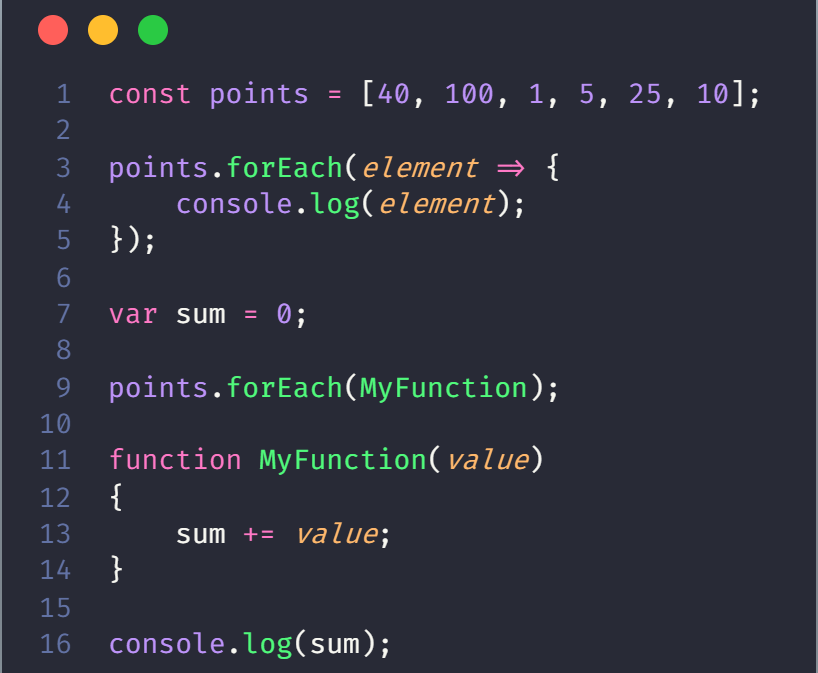
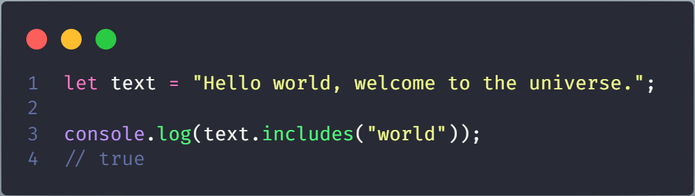
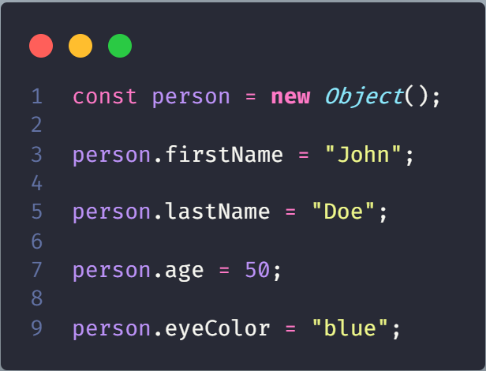
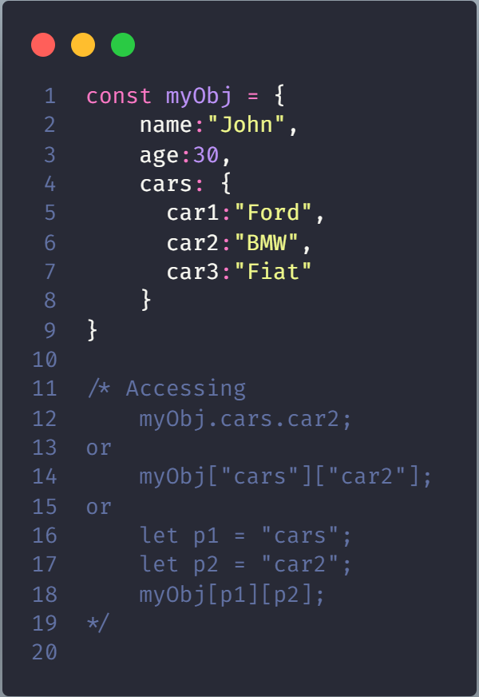
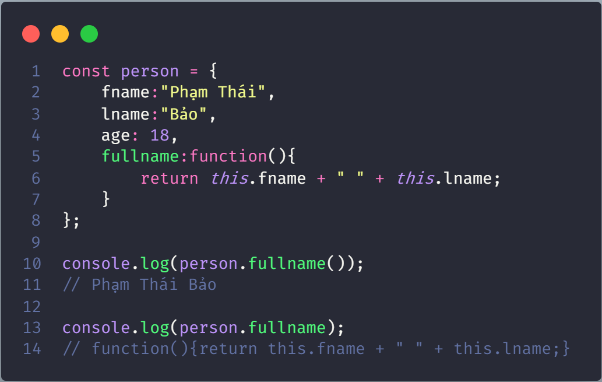
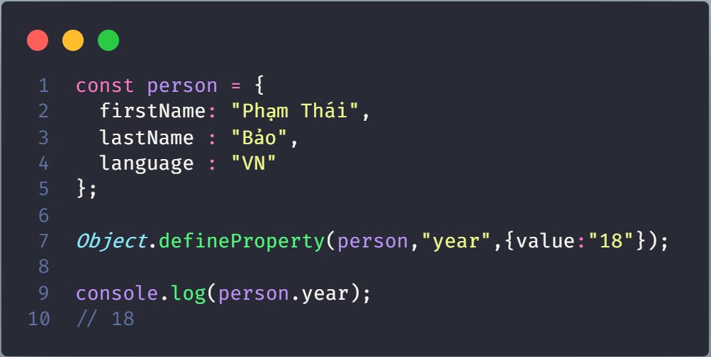

# Tutorial JavaScript

## Câu lệnh xuất

- alert('') hoặc alert(""):Khi truy cập trang web với nội dung ghi trong cặp '' hoặc cặp ""
- console.log('') hoặc console.log(""): Nội dung sẽ xuất hiện trong phần console của trang web. Nên dùng lệnh này để học Javascript
- prompt('') hoặc prompt(""): Hiện ra một cái bảng Nội dung trong '' hoặc "" sẽ là tiêu đề, và sẽ nhập nội dung
- document.getElementById("name_ID").innerHTML = < nội dung muốn in ra > : có thể là  nội dung trong '' hoặc trong "", hoặc biến kiểu giá trị số

## Câu lệnh comment

- Comment 1 dòng: //
- Comment nhiều dòng : /**/

## Cách sử dụng biến

### Cú pháp đặt tên

- Số (0-9): Không thể đứng đầu
- Kí tự: Đô-la ($)
- Chữ cái: (A-Z) và (a-z)
- Dấu gạch chân: (_)

#### Các loại giá trị

- Câu lệnh: **typeof** + tên_biến : kiểu dữ liệu của biến đó
- Cây lệnh: **instanceof** + tên biến dùng để kiểm tra biến này có phải là một object không
- Các kiểu dữ liệu của biến: number(bao gồm số thực và số nguyên), **infinity**,string, boolean, object, function, **undefined**, **null**,**NaN**, **Symbol**
  - infinity: dạng giá trị +oo hoặc -oo (16/0,1/0,...)
  - undefined: khi in ra biến chỉ được khai báo mà không có giá trị
  - null: Khi biến không chứa gì cả
  > Null và undefined khó hiểu
  - NaN (not a number):
    - Khi dùng toán tử giữa các toán hạng mà không phải dạng số
    - Dùng hàm tính toán nhưng vi phạm công thức: sqrt(-1),...
  - Symbol: kiểu dữ liệu **unique**
- Câu lệnh khai báo: từ khóa **var**,**let** hoặc **const** + tên biến
  - **var**
    - Khai báo lại nhiều lần
    - Biến dạng toàn cục
    - Được gán giá trị cho biến trước khi **khai báo bằng từ khóa var**

    

    >Chương trình trên in ra giá trị 53
  - **let**
    - Lhai báo một lần
    - Biến cục bộ
    - Không được gán giá trị cho biến trước khi khai báo

        
        > Chương trình trên báo lỗi vì không được gán giá trị cho biến trước khi khai báo
  - **const**
    - Xác định một tham chiếu không đổi đến giá trị
    - Không thể khai báo lại
    - Có thể thay đổi phần tử khi khai báo Object hoặc Array
    - Thay đổi thuộc tính của đối tượng

        .png)

        .png)

## Toán tử

- Vẫn có toán tử 3 ngôi
- Phép toán lũy thừa: **
- Phép so sánh:
  - ==: chỉ so sánh về giá trị. Ngược lại toán tử này là "! =="
        Ví dụ: '16' == 16 là true
  - ===: so sánh về giá trị và kiểu dữ liệu của 2 toán hạng. Ngược lại toán tử này là "!=="

> Mặc định: toán tử của C++ thì Javascript có, ở đây chỉ bàn những cái riêng của ngôn ngữ JavaScript

## Vòng lặp

### for, do-while, while

Giống ngôn ngữ lập trình C++

### for in

- Trong mảng(hoặc trong chuỗi) sẽ lần lượt là giá trị *từ đầu mảng đến cuối mảng*

    

- Trong object sẽ lần lượt là các key của object

    

### for of

Dùng cho mảng, chuỗi...(chưa học tới những cái còn lại)

## Số

### Giới hạn

- Số trong JavaScript sẽ chứa được 10^15 chữ số
- Nhưng sau đây là ví dụ, gây khó hiểu :)

    
    > Khi 1 số dưới 10^15-1 thì sẽ hiển thị bình thường, khi 1 số >=10^15 và <=10^21-2 khi chữ số cuối cùng là lẻ:1,5,9 sẽ +1 đơn vị ở cuối còn 3,7 sẽ -1 đơn vị ở cuối. Còn >=10^21-1 sẽ thể hiện ở dạng hằng số khoa học

### Lưu ý khi sử dụng biến dạng số

- Cộng số thực trong JavaScript sẽ làm tròn đến số thập phân thứ 15

    

- Phép cộng: giữa các số thì ra kết quả số, nếu có 1 phần tử chuỗi thì sẽ ra chuỗi

    

- Phép cộng giữa các mảng, số, chuỗi(quá khó hiểu)

    

- Phép nhân,chia, trừ giữa các chuỗi thì các chuỗi sẽ được ép thành số để thực hiện

    

- Phép nhân, chia, trừ giữa một chuỗi (có kí tự không phải số) và 1 số hoặc giá trị **NaN** với 1 số (hoặc 1 chuỗi) sẽ cho ra giá trị **NaN**

- Phép cộng giữa chuỗi với giá trị **NaN** thì sẽ hiểu **NaN** là một chuỗi

- Giá trị Infinity (or -Infinity) được hiểu là giá trị vô cùng, khi in ra thì hiển thị "Infinity" hoặc "-Infinity". Giá trị loại này các số / 0

### Một số hàm khi sử dụng biến số

- new Number(value): Tạo ra 1 số có giá trị thông qua hàm này. Tuy nhiên, hàm này được đánh giá là có tốc độ chậm và có thể cho ra kết quả không mong đợi

- Hàm toString(x): ứng dụng chuyển 1 số sang hệ x (2 <= x <= 36)  

- Hàm toExponential(): trả về 1 chuỗi dạng, với kết quả là 1 số được làm tròn và được viết bằng kí hiệu hàm mũ (hằng số khoa học: e)

    

- Hàm toFixed(): trả về 1 chuỗi, với kết quả là 1 số được viết dưới dạng thập phân đầy đủ

    

- Hàm toPrecision(): trả về chuỗi, với kết quả là số được viết dưới dạng độ dài theo yêu cầu

    

- Hàm chuyển đổi sang giá trị số

  - Number(): trả về 1 số. Nếu không sẽ ra giá trị **NaN**

    

  - parseInt(): Phân tích một chuỗi và trả về 1 số nguyên, nếu có khoảng trắng trả về số đầu tiên
  
    

  - parseFloat(): Phân tích một chuỗi và trả về 1 số thực, nếu có khoảng trắng trả về số đầu tiên

    

- Hàm trả về giá trị lớn nhất và nhỏ nhất **theo ngôn ngữ JavaScript**

## Cấu trúc dữ liệu

### Mảng (Array)

#### Khởi tạo

- Từ khóa khai báo biến(var, let hoặc const) + tên biến = [các giá trị ngăn cách nhau ',']. Có thể không cần khai báo mảng chứa phần tử nào

    &printArray.png)

- Từ khóa khai báo biến(var, let hoặc const) + tên biến = new Array(các giá trị ngăn cách nhau ',')

    .png)

> Mặc định khi tạo array, các phần tử bắt đầu tù chỉ số 0

#### Truy cập phần tử

Câu lệnh: Tên_mảng[chỉ_số]

#### Tìm hiểu thêm

- Typeof + tên mảng : cho ra mảng là một object. Thật vậy, do mỗi phần tử của mảng có thể là số nguyên, số thực, function, object hoặc chuỗi...
- Mảng khác Object ở chỗ, chúng ta truy cập phần tử mảng thông qua biến chỉ số còn truy cập Object thông qua Object
- Phần tử đầu: [0] ; phần tử cuối [tên_mảng.length-1]
- Hai cách khai báo sau là **hoàn toàn khác nhau**

    .png)

    .png)

- Cách phân biệt Array và Object
  - Dùng hàm: **.isArray**
  - Câu lệnh: **instanceof Array**

#### Các hàm thông dụng trong mảng

- toString: Chuyển các giá trị phần mảng sang kiểu string

    

- join: Tạo ngăn cách giữa các phần tử

    

- pop: Xóa phần tử cuối cùng
- push: Thêm phần tử vào đầu mảng
- shift: Xóa phần tử đầu tiên đồng thời dịch vị trí các phần tử khác sang trái 1 đơn vị

    

- unshift: Thêm phần tử đầu tiên vào mảng đồng thời dịch các phần tử sang phải 1 đơn vị

    

- splice(x, y, value1, value2, ...) : Xóa y phần tử sau đó thêm phần tử vào vị trí x.

    

- splice(x,y): Xóa y phần tử bắt đầu từ vị trí x

- slice(x): Tạo ra một mảng mới gồm các phần tử từ vị trí x đến cuối mảng

- concat: Tạo ra mảng mới bằng các mảng có sẵn

    

- reverse: Đảo ngược mảng
- map: Tạo mảng mới bằng việc thực hiện một chức năng trên mỗi phần tử

    

- filter: Tạo mảng mới bằng việc kiểm tra mỗi phân tử theo một điều kiện bất kì

    

- reduce: Thực hiện một thao tác mỗi phần tử để tạo ra một giá trị. Chạy từ trái sang phải (đầu mảng đến cuối mảng)

    

- reduceRight: Thực hiện một thao tác mỗi phần tử để tạo ra một giá trị. Chạy từ phải sang trái (cuối mảng đến đầu mảng)

- every: Thực hiện kiểm tra tất các phần tử có thỏa điều kiện nào đó, tạo ra một giá trị

    

- some: Thực hiện một số phần tử có thỏa điều kiện nào đó, tạo ra một giá trị

    

- indexOf: Tìm kiếm một phần tử có thỏa một giá trị đưa ra hay không (có thể cho vị trí bắt đầu tìm kiếm nhưng nếu không có thì mặc định bắt đầu từ đầu mảng). Nếu có thì trả về vị trí thỏa điều kiện đầu tiên còn không thì -1

    

- lastIndexOf: Tìm kiếm một phần tử có thỏa một giá trị đưa ra hay không (có thể cho vị trí bắt đầu tìm kiếm nhưng nếu không có thì mặc định bắt đầu từ cuối mảng). Nếu có thì trả về vị trí thỏa điều kiện đầu tiên còn không thì -1

- includes: Kiểm tra một giá trị có xuất hiện trong mảng hay không (bao gồm cả giá trị **NaN**). Giá trị trả về: True/False

    

- Math.max.apply: Tìm phần tử lớn nhất trong mảng.

    

- Math.min.apply: Tìm phần tử nhỏ nhất trong mảng

    

#### Sắp xếp

sort: Hàm sắp xếp theo tiêu chí của bảng ASCII. Vấn đề đặt ra: Làm sao so sánh số ? Dùng function để xử lí chuyện này

#### Phương thức duyệt mảng

##### Cơ bản

##### Dùng forEach

### Chuỗi

#### Định nghĩa

- Là 1 dạng object trong JavaScript

- Được đặt trong cặp dấu nháy đơn hoặc nháy kép

- Không được đặt cặp dấu nháy mà đã dùng khai báo trong chuỗi vì JavaScript sẽ hiểu là một chuỗi khác. Để giải quyết vấn đề này, ta dùng dấu \ .

- Muốn thêm kí tự \ thì thêm \ vào

.png)

- Dùng hàm new String() để tạo chuỗi

### Truy cập phần tử của chuỗi

- Toán tử: []

- Phương thức: charAt(position)

> Phương thức charCodeAt(position) trả về số thứ tự của bảng mã ASCII của kí tự tại vị trí position trong chuội

### Các hàm thông dụng trong chuỗi

- length: Lấy độ dài của chuỗi

- slice(start,end): trích xuất 1 phần của chuỗi từ vị trí start đến vị trí end(start < end), tính từ đầu chuỗi. Kết quả trả về vị trí chuỗi mới.

    

- slice(-start,-end): trích xuất 1 phần của chuỗi từ vị trí start đến vị trí end(-start > - end), tính từ cuối chuỗi. Kết quả trả về vị trí chuỗi mới.

    .png)

- slice(start): trích xuất 1 phần của chuỗi từ vị trí start đến cuối chuỗi (start < độ dài chuỗi), tính từ đầu chuỗi. Kết quả trả về vị trí chuỗi mới.

    .png)

- slice(-start): trích xuất 1 phần của chuỗi từ vị trí start đến cuối chuỗi (|start| < độ dài chuỗi), tính từ cuối chuỗi. Kết quả trả về vị trí chuỗi mới.

    .png)

- substring(start,end): trích xuất 1 phần của chuỗi từ vị trí start đến vị trí end(start < end), tính từ đầu chuỗi. Kết quả trả về vị trí chuỗi mới. (Không chấp nhận tham số âm)

- substring(start): trích xuất 1 phần của chuỗi từ vị trí start đến cuối chuỗi (start < độ dài chuỗi), tính từ đầu chuỗi. Kết quả trả về vị trí chuỗi mới.

- substr(start,length): trích xuất 1 phần của chuỗi từ vị trí start với độ dài length. Kết quả trả về vị trí chuỗi mới

    

- substr(start): trích xuất 1 phần của chuỗi từ vị trí start đến cuối chuỗi (start < độ dài chuỗi), tính từ đầu chuỗi. Kết quả trả về vị trí chuỗi mới.

- substr(-length): trích xuất 1 phần của chuỗi từ vị trí cuối chuỗi lấy chuỗi có độ dài |length|. Kết quả trả về vị trí chuỗi mới.

    .png)

- replace(x,y): Tìm chuỗi x trong chuỗi và thay thế thành chuỗi y. Lưu ý: chỉ thay thế chuỗi tìm thấy đầu tiên và có phân biệt kí tự chữ hoa và kí tự chữ thường

    

    .png)

    .png)

- toUpperCase(): Kết quả trả về chuỗi chữ hoa

- toLowerCase(): Kết quả trả về chuỗi chữ thường

- concat(s1,s2,...): trả về chuỗi mới khi nối chuỗi với các chuỗi s1,s2... (không giới hạn)

    

- trim(): trả về chuỗi mới khi xóa hết khoảng trắng ở đầu và cuối chuỗi

    

- padStart(count,String): Nếu chuỗi hiện tại có độ dài >= count thì bỏ qua, ngược lại thêm count-length kí tự từ String(nếu chưa thỏa độ dài có thể lặp lại), thêm vào đầu chuỗi

    

- padEnd(count,String): Nếu chuỗi hiện tại có độ dài >= count thì bỏ qua, ngược lại thêm count-length kí tự từ String(nếu chưa thỏa độ dài có thể lặp lại), thêm vào cuối chuỗi

    

- split(character): Phân tách chuỗi dựa vào kí tự character vào 1 mảng, nếu kí tự character là rỗng thì truyền từng kí tự vào chuỗi, nếu kí tự character sai thì toàn bộ chuỗi chuyển vào phần tử thứ 0 của mảng

    

- indexOf(string): trả về vị trí string[0] nguyên khi tìm tìm thấy string trong chuỗi, tính từ đầu chuỗi. Trả về giá trị -1 nếu không tìm thấy

    

- indexOf(string, position): trả về vị trí string[0] nguyên khi tìm tìm thấy string trong chuỗi, tính từ vị trí position trong chuỗi đến cuối chuỗi. Trả về giá trị -1 nếu không tìm thấy

- lastIndexOf(string): trả về vị trí string[0] nguyên khi tìm tìm thấy string trong chuỗi, tính từ cuối chuỗi. Trả về giá trị -1 nếu không tìm thấy

    

- lastIndexOf(string, position): trả về vị trí string[0] nguyên khi tìm tìm thấy string trong chuỗi, tính từ vị trí position ngược về đầu chuỗi. Trả về giá trị -1 nếu không tìm thấy

- search(string): trả về vị trí string[0] nguyên khi tìm tìm thấy string trong chuỗi, tính từ đầu chuỗi. Trả về giá trị -1 nếu không tìm thấy

> Đối với regular expression thì indexOf sẽ không hoạt động chỉ có thể dùng hàm search

- includes(string): trả về giá trị true khi tìm thấy string trong chuỗi ngược lại trả về giá trị false khi không tìm thấy string trong chuỗi

    

- includes(string, position): trả về giá trị true khi tìm thấy string từ vị trí position đến cuối chuỗi ngược lại trả về giá trị false khi không tìm thấy string trong chuỗi

- startsWith(string): trả về giá trị true khi chuỗi bắt đầu với string ngược lại trả về giá trị false khi chuỗi không bắt đầu với string

- startsWith(string, position): trả về giá trị true khi chuỗi tại vị trí position bắt đầu với string ngược lại trả về giá trị false khi chuỗi không bắt đầu với string

> startsWith sẽ không phân biệt được chữ hoa và chữ thường

- ends(string): trả về giá trị true khi chuỗi kết thúc với string ngược lại trả về giá trị false khi chuỗi không kết thúc với string

- ends(string, length): trả về giá trị true khi chuỗi kết thúc với string trong độ dài length tính từ đầu chuỗi ngược lại trả về giá trị false khi chuỗi không kết thúc với string

> endsWith sẽ không phân biệt được chữ hoa và chữ thường

### Templates của String

- Khai báo chuỗi với cặp dấu ``

- Khi chuỗi được chứa trong `` thì cặp '' và cặp "" sẽ không bị lỗi

- In chuỗi trong chuỗi (đối với chuỗi chính được khai báo trong ``) dùng ${}

    

    .png)

## Function

### Các loại hàm

#### Function Declarations

Function được khai báo sẽ không thực thi ngay lập tức. Được lưu để sau này sử dụng và được thực thi khi được gọi

#### Function Expressions

- JavaScript function được lưu dưới dạng biểu thức

- Sau khi Function Expressions được lưu ở biến thì biến này có thể dùng như tên để gọi Function Expressions

#### Function Constructor

Định nghĩa bằng một phương thức khởi tạo hàm JavaScript dựng sẵn tên Function()

> Hầu hết, nên tránh dùng tù khóa _**new**_ để khai báo biến

#### Function Hoisting

- Hoisting là hành vi mặc định của JavaScript để di chuyển các khai báo lên đầu _**phạm vị hiện tại**_

- Hoisting áp dụng cho khai báo biến và khai báo hàm

#### Self-Invoking Functions

- Là dạng biểu thức bắt đầu tự động mà không cần gọi

- Function expression sẽ tự động thực thi theo sau bởi ()

- Bản thân người sử dụng sẽ không thể gọi loại hàm này

- Phải thêm dấu ngoặc đơn xung quanh để biểu thi rằng nó là một Function expression

> Đây là hàm ẩn danh (hàm không có tên)

#### Functions are Objects

- JavaScript functions tốt nhất có thể được mô tả dưới dạng các đối tượng

- JavaScript functions có cả thuộc tính và phương thức

#### Arrow Functions

- Arrow Functions are not hoisted, phải được khai báo trước khi sử dụng

- Dùng từ khóa **const** an toàn hơn **var**, vì function expression luôn mang giá trị hằng

### Tham số

#### Tham số mặc nhiên

## Object

- Object là variable có thể mang nhiều giá trị

> Thực tế, khi khai báo Object ta thường dùng từ khóa **const**

- Từ khóa **this**

- Có thể khai báo các loại giá trị: boolean, strings, numbers như là một object

    

> Không nên khai báo các giá trị: boolean, strings, numbers là một object

- Các loại Object: Dates, Maths, Regular expressions, Arrays, Functions

### JavaScript Primitives

- Primitive value: value không có properties or methods

- Primitive data type: data that has a primitive value, include:

  - **string**

  - **number**

  - **boolean**

  - **null**

  - **undefined**

> if x = 3.14, you can change the value of x. But you cannot change the value of 3.14.

### Khởi tạo Object

- Sử dụng từ khóa **new()**

    

- Khởi tạo theo cách thông thường

    

### JavaScript Objects có thể thay đỗi

Object là các tham chiếu, không phải giá trị

> Object x lúc này không phải là copy, Object x chính là Object person

### Accessing JavaScript Properties

### JavaScript for...in Object

### Adding and Delete Properties

> or **delete person["age"]**

### Nested Objects

### Nested Array and Accessing

### Accessing Function

### Display Object

Gọi tên thông thường, dùng vòng lặp... Một số cách khác

#### Object.value

Dùng hàm Object.values(object cần chuyển đổi thành mảng)

.png)

#### JSON.stringify()

- Dùng hàm JSON.stringify(object cần chuyển đổi thành chuỗi)

    .png)

- Funcion sẽ không hoạt động

- Hàm Date(), sẽ có kết quả dạng: 2021-12-23T10:34:10.122Z

- Đối với mảng

    WhenUseWithArray.png)

### Object Accessors

#### Getter (The get Keyword)

Khi dùng từ khóa get vào method của Object, khi gọi có thể bỏ "()", kết quả vẫn lấy value

#### Setter (The set Keyword)

### Object.defineProperty()

Dùng để định nghĩa method cho object cụ thể

### Object Constructors

#### Object Types (Blueprints)

- Tạo Object dùng object constructor function

    

- Adding Property hoặc Method trong constructor function: dùng **prototype** Property

    

### Built-in JavaScript Constructors

### Operator Iterables

- Itaretol protocol dùng để tạo sequence of values từ object. Object trở thành iteratol khi bổ sung **next()** method

- Method **next()** trả về object với 2 properties:

  - value: value return by the iteratol ( bị bỏ qua khi property **done** là true)
  
  - done:

    - true: iterator khi completed

    - false: iterator còn tạo ra kết quả mới

   

> Khi dùng iterable loại này thì câu lệnh for..of không được hỗ trợ

- Dùng **Symbol.iterator**: là một function trả về **next()** function, kết hợp với cấu trúc **for..of**

    

### Object Reference

#### Managing Objects

#### Protecting Objects

#### Changing a Property Value

- Thay đổi giá trị của Value dựa vào Property

- Syntax: Object.defineProperty(object, property, {value : value})

#### Changing Meta Data 

- List Methods

    

- Allows **getter and setter** to be changed

    

    

    

#### Listing All Properties

Object.getOwnPropertyNames(object) return an array contain the property of object

#### Listing Enumerable Properties

- Liệt kê những Property có enumerable: false

- Syntax: Object.keys(object)

#### Adding a Property

## Object Sets

- Cấu trúc dữ liệu chỉ chứa unique values

- Mỗi giá trị chỉ xuất hiện một lần 1 lần trong Sets

- Hold any value of any data type

## Iterate over the elements of a Set

Use **for..of**

## Method in Sets

### Create Set and method add()

- Truyền tham số dạng mảng và từ khóa **new Set()**

- Tạo một Set và dùng **add()** để add values

- Tạo một Set và dùng **add()** để add variables

### forEach()

### values()

Returns an Iterator object containing all the values in a Set

### keys

- A Set has no keys.

- keys() returns the same as values().

- This makes Sets compatible with Maps.

### entries

- entries() returns [value,value] pairs instead of [key,value] pairs.

- This makes Sets compatible with Maps

## Set is Object

- For a Set, typeof returns object

- For a Set, instanceof Set returns true

## Objects Maps

- Map là cấu trúc dữ liệu lưu trữ cặp key-value, keys có thể là bất cứ kiểu dữ liệu nào

- Map sẽ theo cấu trúc: First In First Out, giữ đúng thứ tự khi chèn phần tử vào

- Map có method xác định size

### Methods Map

#### new Map()

- Truyền cặp key-value thông qua Array bằng câu lệnh **new Map()**

- Tạo sẵn Map, dùng **Map().set** truyền cặp key-value

    

#### Map.get()

Lấy value dựa vào key

> Map.get(key) sẽ trả về undefined

#### Map.size

Lấy size của Map

#### Map.delete()

Xóa 1 cặp key-value

#### Map.clear()

Xóa toàn bộ element trong Map

#### Map.has()

Kiểm tra sự tồn tại của cặp key-value

### Map is Objects

- For a Map, typeof returns object

- For a Map, instanceof Map  returns true

### Use method in Object

#### forEach

Duyệt lần lượt từng phần tử trong Map

#### keys() in Map

Liệt kê tất cả keys trong Map

#### values() in Map

Liệt kê tất cả values trong Map

#### entries() in Map

Liệt kê tất cả key-value trong Map

#### Objects as Key in Map

